# 노코드 자동화 기초: 워크플로우 설계

## 1. 프로젝트 개요

본 과제는 반복 업무를 노코드 자동화 도구로 구현하고, Trigger·Action·조건 분기의 동작 원리를 이해하는 것을 목표로 한다.

총 2개의 프로젝트를 수행하였다.

- **프로젝트 1:** 동일한 채용 공고 관리 워크플로우를 Make와 Zapier에서 각각 구현하고 비교
- **프로젝트 2:** 서버 장애 제보를 심각도에 따라 자동 분류하고 담당자에게 알리는 워크플로우 구현

---

## 2. 전체 폴더 구조

```text
.
├── README.md
└── docs
    └── images
        ├── project1
        │   ├── common
        │   ├── make
        │   └── zapier
        └── project2
            └── make
```

---

# 프로젝트 1. 채용 공고 및 지원 일정 자동 관리

## 3. 반복 업무 정의

채용 공고를 확인할 때마다 회사명, 지원 직무, 공고 URL, 마감일, 지원 상태를 수기로 정리하고 마감 임박 여부를 확인하는 업무를 자동화하였다.

Google Form에 채용 공고를 등록하면 원본 응답이 Google Sheets에 저장되고, 마감일까지 남은 기간에 따라 긴급 또는 일반 경로로 분류된다. 분류 결과는 별도 결과 시트에 저장되며 Gmail 알림이 발송된다.

## 4. 입력 및 출력 규격

### 입력

| 항목 | 형식 | 설명 |
|---|---|---|
| 회사명 | 단답형 | 채용 기업명 |
| 지원 직무 | 단답형 | 지원 예정 직무 |
| 채용 공고 URL | URL | 원문 채용 공고 주소 |
| 지원 마감일 | 날짜 | 지원 종료일 |
| 지원 상태 | 드롭다운 | 관심 공고, 지원 예정, 지원 완료 |
| 메모 | 장문형 | 준비 사항 또는 참고 내용 |

### 출력

| 항목 | 설명 |
|---|---|
| 자동화 실행일시 | 워크플로우가 실행된 시각 |
| 회사명 | 입력된 기업명 |
| 지원 직무 | 입력된 직무 |
| 채용 공고 URL | 입력된 공고 주소 |
| 지원 마감일 | 입력된 지원 종료일 |
| 지원 상태 | 현재 지원 상태 |
| 마감 분류 | 긴급 또는 일반 |
| 사용 도구 | Make 또는 Zapier |
| 이메일 발송 상태 | 알림 발송 여부 |
| 메모 | 입력된 참고 내용 |

## 5. 공통 워크플로우

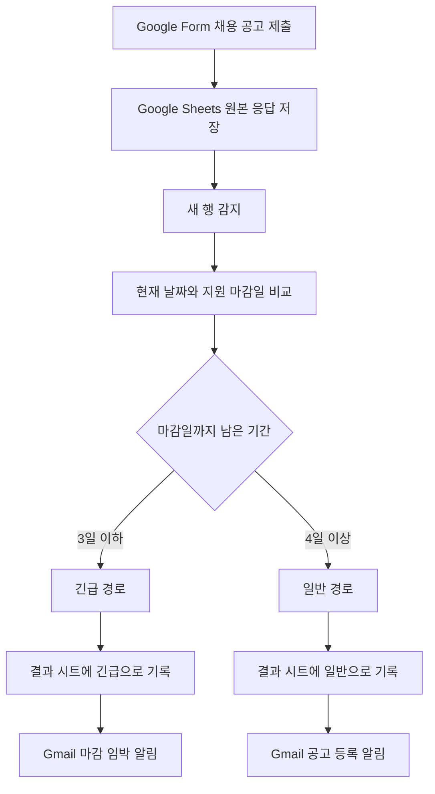

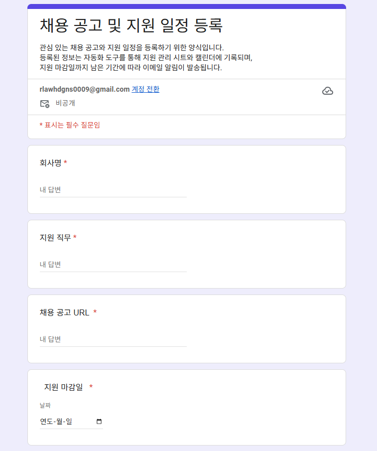

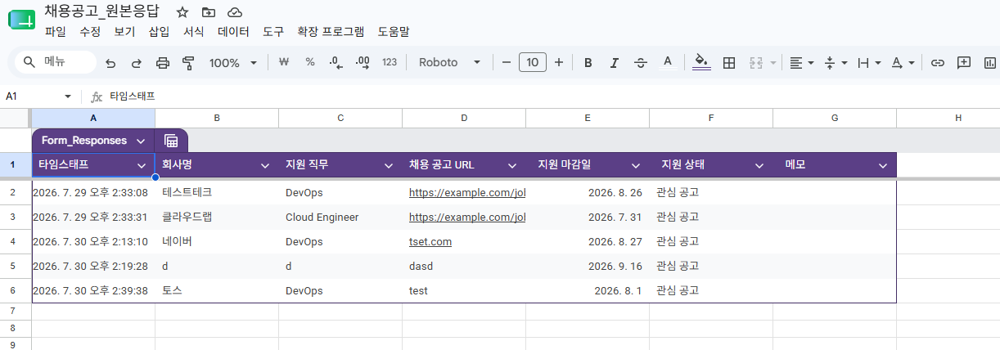

---

## 6. Make 구현

### 6.1 사용 모듈

| 순서 | 모듈 | 역할 |
|---:|---|---|
| 1 | Google Sheets - Watch New Rows | Google Form 원본 응답 시트의 새 행 감지 |
| 2 | Router | 긴급·일반 경로 분기 |
| 3 | Filter | 지원 마감일 기준 조건 판정 |
| 4 | Google Sheets - Add a Row | Make 결과 시트에 데이터 저장 |
| 5 | Gmail - Send an Email | 분기 결과에 맞는 이메일 발송 |

### 6.2 조건 분기

#### 긴급 경로

```text
오늘 날짜 ≤ 지원 마감일 ≤ 오늘 날짜 + 3일
```

#### 일반 경로

```text
지원 마감일 > 오늘 날짜 + 3일
```

지원 마감일 값은 Google Sheets에서 전달된 날짜 형식에 맞춰 날짜 타입으로 변환한 후 비교하였다.

### 6.3 결과 저장

- 결과 시트: `Make_Result`
- 긴급 경로 고정값
  - 마감 분류: `긴급`
  - 사용 도구: `Make`
- 일반 경로 고정값
  - 마감 분류: `일반`
  - 사용 도구: `Make`

자동화 실행일시는 다음 형식으로 저장하였다.

```text
{{formatDate(now; "YYYY-MM-DD HH:mm:ss"; "Asia/Seoul")}}
```

### 6.4 이메일 알림

#### 긴급 경로 제목

```text
[마감 임박] 회사명 - 지원 직무
```

#### 일반 경로 제목

```text
[채용 공고 등록] 회사명 - 지원 직무
```

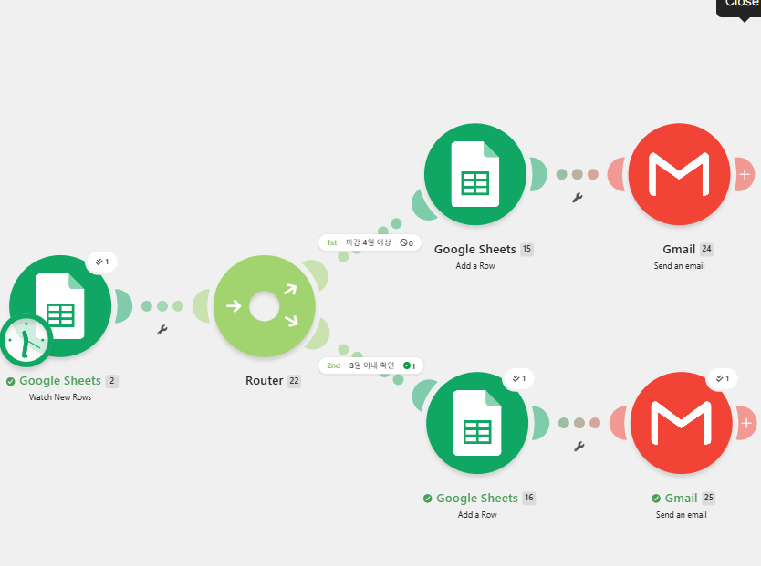

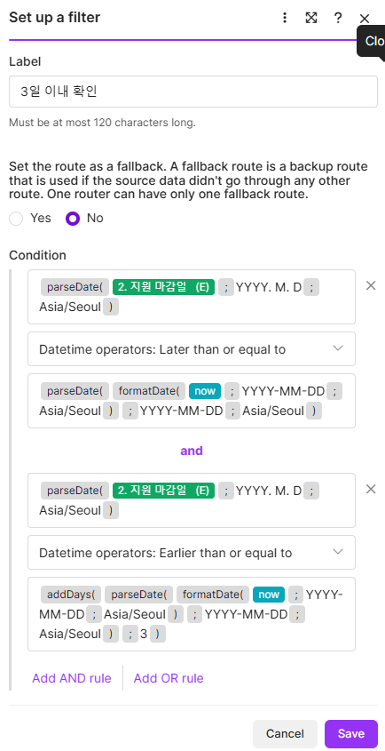

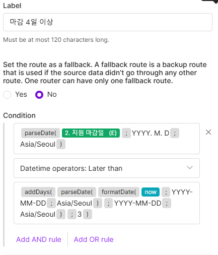

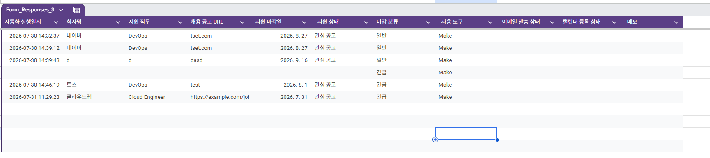


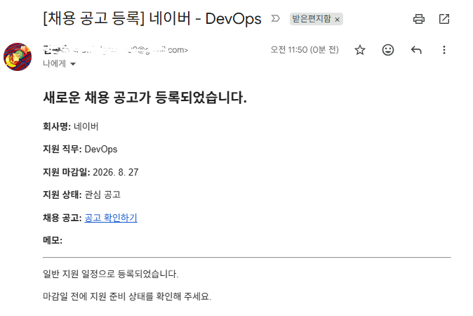

---

## 7. Zapier 구현

### 7.1 사용 단계

| 순서 | 앱 또는 기능 | 역할 |
|---:|---|---|
| 1 | Google Sheets - New Spreadsheet Row | 원본 응답 시트의 새 행 감지 |
| 2 | Formatter by Zapier - Date/Time | 현재 날짜와 지원 마감일 비교 |
| 3 | Paths | 긴급·일반 경로 분기 |
| 4 | Google Sheets - Create Spreadsheet Row | Zapier 결과 시트에 데이터 저장 |
| 5 | Gmail - Send Email | 분기 결과에 맞는 이메일 발송 |

### 7.2 날짜 비교

- Start Date: 현재 시각
- End Date: Google Sheets의 지원 마감일
- End Date Format: `YYYY. M. D`
- Timezone: `Asia/Seoul`

Formatter의 출력값 중 다음 항목을 분기 조건에 사용하였다.

- `Output Days`
- `Output Dates Swapped`

### 7.3 Paths 조건

#### 긴급 경로

```text
Output Dates Swapped = false
AND
Output Days ≤ 3
```

#### 일반 경로

```text
Output Dates Swapped = false
AND
Output Days > 3
```

### 7.4 결과 저장

- 결과 시트: `Zapier_Result`
- 긴급 경로 고정값
  - 마감 분류: `긴급`
  - 사용 도구: `Zapier`
- 일반 경로 고정값
  - 마감 분류: `일반`
  - 사용 도구: `Zapier`


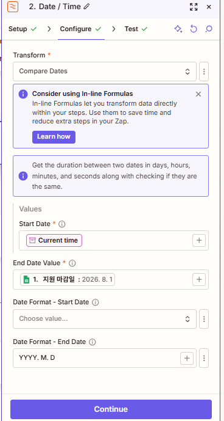

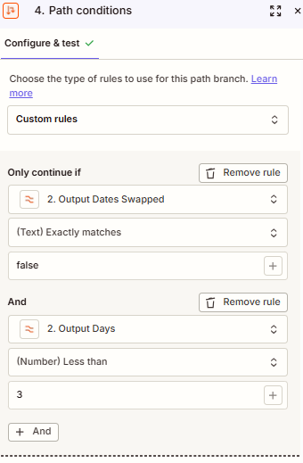

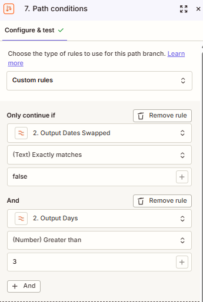

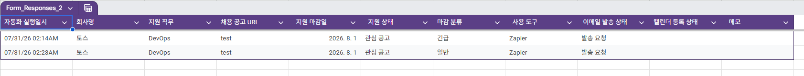


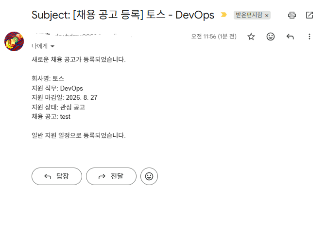

---

## 8. 프로젝트 1 테스트 결과

### 긴급 경로 테스트

| 항목 | 입력값 |
|---|---|
| 회사명 | 테스트테크 |
| 지원 직무 | DevOps Engineer |
| 지원 마감일 | 실행일 기준 2일 후 |
| 지원 상태 | 지원 예정 |
| 메모 | 긴급 경로 테스트 |

예상 및 확인 결과:

- Make와 Zapier 모두 긴급 경로 실행
- 결과 시트에 `긴급`으로 저장
- 마감 임박 이메일 발송

### 일반 경로 테스트

| 항목 | 입력값 |
|---|---|
| 회사명 | 클라우드랩 |
| 지원 직무 | Cloud Engineer |
| 지원 마감일 | 실행일 기준 7일 후 |
| 지원 상태 | 관심 공고 |
| 메모 | 일반 경로 테스트 |

예상 및 확인 결과:

- Make와 Zapier 모두 일반 경로 실행
- 결과 시트에 `일반`으로 저장
- 채용 공고 등록 이메일 발송

---

## 9. Make와 Zapier 비교

| 비교 항목 | Make | Zapier |
|---|---|---|
| UI/UX | 노드와 연결선을 이용해 전체 흐름을 한 화면에서 보기 쉽다. | 단계가 위에서 아래로 나열되어 초보자가 순서대로 설정하기 쉽다. |
| 조건 분기 | Router와 각 경로의 Filter를 이용해 시각적으로 분기한다. | Paths를 이용해 경로별 조건과 후속 Action을 구성한다. |
| 날짜 처리 | 함수와 날짜 형식을 직접 지정할 수 있어 유연하지만 문법과 대소문자에 주의해야 한다. | Formatter가 날짜 차이를 계산해 주므로 결과값을 Paths에서 활용하기 편하다. |
| 설정 난이도 | 복잡한 워크플로우 표현은 편리하지만 초기 학습 곡선이 있다. | 기본 단계는 직관적이지만 Formatter와 Paths가 추가되면 단계 수가 늘어난다. |
| 데이터 매핑 | 이전 모듈의 토큰을 각 입력 필드에 직접 매핑한다. | 이전 Step의 출력 필드를 검색해 선택하는 방식이다. |
| 실행 로그 | 모듈과 필터별 Bundle 흐름을 세밀하게 확인할 수 있다. | Step 테스트와 Zap History를 통해 단계별 결과를 확인한다. |
| 오류 확인 | 필터 통과 여부와 각 모듈 입출력을 한 화면에서 추적하기 좋다. | 오류 메시지는 비교적 이해하기 쉽지만 복잡한 분기 전체 흐름은 여러 화면을 확인해야 한다. |
| 무료 플랜 활용 | 비교적 다양한 모듈과 분기 구조를 무료 범위에서 시험하기 좋다. | 다단계 Zap과 Paths는 계정 플랜 또는 체험 환경에 따라 제약될 수 있다. |
| 워크플로우 가독성 | 복잡한 분기와 병렬 처리에 유리하다. | 단순한 직선형 업무 자동화에 유리하다. |
| 적합한 상황 | 다중 분기, 여러 서비스 연동, 복잡한 데이터 변환 | 빠른 구축, 간단한 업무 연결, 초보자 중심의 자동화 |

## 10. 도구별 장단점

### Make

장점:

- 전체 워크플로우를 시각적으로 확인하기 쉽다.
- Router를 이용한 다중 분기 표현이 직관적이다.
- 실행 과정에서 Bundle이 어느 경로를 통과했는지 확인하기 쉽다.
- 함수와 데이터 변환 기능을 세밀하게 조정할 수 있다.

단점:

- 날짜 함수와 형식 토큰의 문법을 정확히 알아야 한다.
- 직접 매핑할 필드가 많아지면 설정 화면이 복잡해질 수 있다.
- 초기 사용자는 Router, Filter, Bundle 개념에 적응이 필요하다.

### Zapier

장점:

- 단계별 설정 화면이 직관적이다.
- Formatter를 통해 날짜 비교 결과를 구조화된 값으로 받을 수 있다.
- 각 Step을 독립적으로 테스트하기 쉽다.
- 단순 자동화는 빠르게 구성할 수 있다.

단점:

- Paths와 다단계 자동화는 플랜 제약을 확인해야 한다.
- 분기 수와 Action 수가 늘어나면 전체 흐름을 한 화면에서 파악하기 어렵다.
- 복잡한 데이터 가공은 Formatter Step이 추가되어 워크플로우가 길어진다.

## 11. 프로젝트 1 결론

단순하고 빠르게 자동화를 구성할 때는 Zapier가 편리했으며, 분기 구조와 데이터 흐름을 시각적으로 확인하고 복잡한 워크플로우로 확장할 때는 Make가 더 적합했다.

이번 채용 공고 관리 자동화는 두 도구 모두 구현할 수 있었지만, 날짜 처리 방식과 분기 설정 방식에서 차이가 있었다. Make는 함수 기반으로 직접 날짜 조건을 구성했고, Zapier는 Formatter의 계산 결과를 Paths 조건으로 사용하였다.

---

# 프로젝트 2. 서버 장애 제보 자동 분류 및 담당자 알림

## 12. 반복 업무 정의

서버 장애 제보가 접수될 때마다 장애 내용을 확인하고, 심각도에 따라 긴급 여부를 판단하여 장애 이력에 기록하고 담당자에게 알리는 업무를 자동화하였다.

## 13. 도구 선정

프로젝트 2에는 **Make**를 사용하였다.

선정 이유:

- Router와 Filter를 이용해 장애 심각도별 경로를 시각적으로 표현할 수 있다.
- Google Sheets와 Gmail을 하나의 시나리오에서 연결할 수 있다.
- 각 경로가 실제로 실행되었는지 Bundle 단위로 확인하기 쉽다.
- 프로젝트 1에서 익힌 Make의 분기 구조를 실무형 장애 대응 업무에 확장할 수 있다.

## 14. 입력 및 출력 규격

### Google Form 입력 항목

| 항목 | 형식 | 설명 |
|---|---|---|
| 발생 서비스 | 드롭다운 | 장애가 발생한 서비스 |
| 장애 발생일 | 날짜 | 장애 발생 날짜 |
| 장애 발생 시간 | 시간 | 장애 발생 시각 |
| 장애 심각도 | 드롭다운 | Critical, High, Medium, Low |
| 장애 증상 | 장문형 | 사용자 또는 시스템에서 확인된 증상 |
| 오류 메시지 | 장문형 | 관련 오류 메시지 |
| 제보자 | 단답형 | 장애 제보자 |

### 결과 시트 출력 항목

| 항목 | 설명 |
|---|---|
| 자동화 실행일시 | Make 실행 시각 |
| 발생 서비스 | 장애가 발생한 서비스 |
| 장애 발생일 | 입력된 발생 날짜 |
| 장애 발생 시간 | 입력된 발생 시각 |
| 장애 심각도 | Critical, High, Medium, Low |
| 장애 증상 | 입력된 증상 |
| 오류 메시지 | 입력된 오류 메시지 |
| 제보자 | 입력된 제보자 |
| 처리 분류 | 긴급 또는 일반 |
| 처리 상태 | 즉시 확인 필요 또는 접수 완료 |
| 사용 도구 | Make |
| 알림 발송 상태 | 이메일 발송 상태 |

## 15. 프로젝트 2 워크플로우

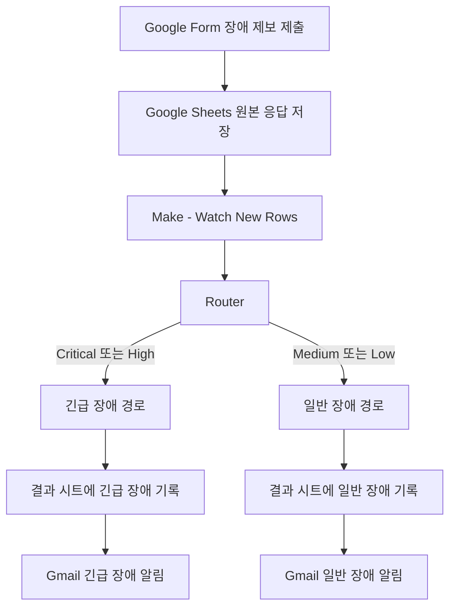

## 16. Make 구성

### 사용 모듈

| 순서 | 모듈 | 역할 |
|---:|---|---|
| 1 | Google Sheets - Watch New Rows | 장애 제보 원본 시트의 새 행 감지 |
| 2 | Router | 긴급·일반 장애 경로 분기 |
| 3 | Filter | 심각도 조건 판정 |
| 4 | Google Sheets - Add a Row | 결과 시트에 장애 이력 저장 |
| 5 | Gmail - Send an Email | 담당자 알림 발송 |

### 긴급 장애 경로

```text
장애 심각도 = Critical
OR
장애 심각도 = High
```

결과 저장값:

```text
처리 분류: 긴급
처리 상태: 즉시 확인 필요
사용 도구: Make
```

### 일반 장애 경로

```text
장애 심각도 = Medium
OR
장애 심각도 = Low
```

결과 저장값:

```text
처리 분류: 일반
처리 상태: 접수 완료
사용 도구: Make
```

## 17. 이메일 알림

### 긴급 장애 이메일 제목

```text
[긴급 장애] 발생 서비스 장애 확인 필요
```

### 일반 장애 이메일 제목

```text
[장애 접수] 발생 서비스 확인 요청
```

이메일 본문에는 다음 내용을 포함하였다.

- 발생 서비스
- 장애 발생일 및 발생 시간
- 장애 심각도
- 장애 증상
- 오류 메시지
- 제보자
- 처리 안내 문구

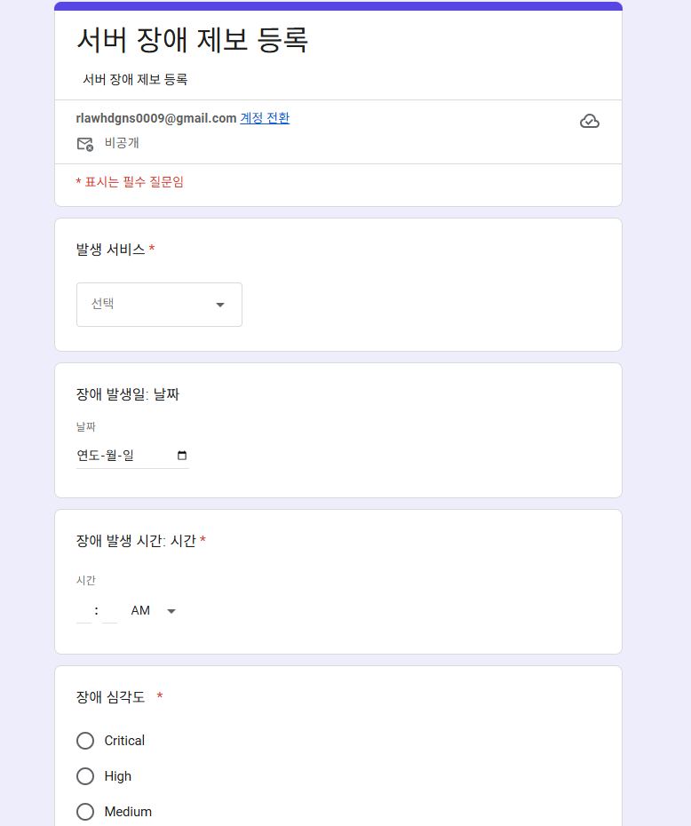

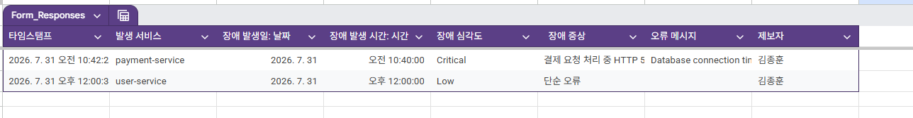

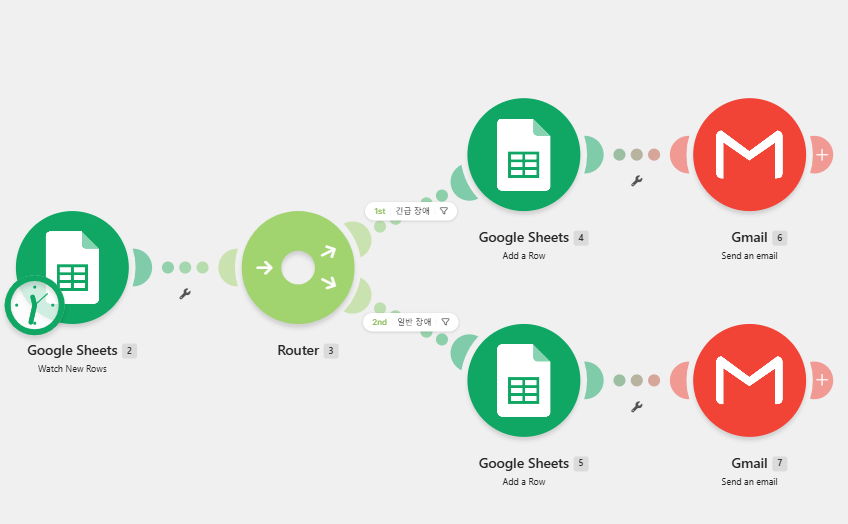

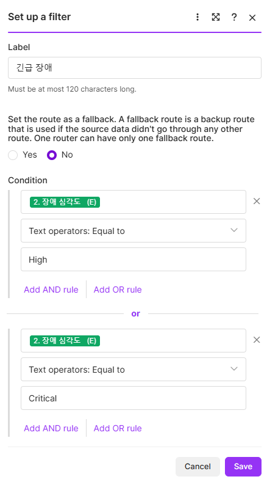

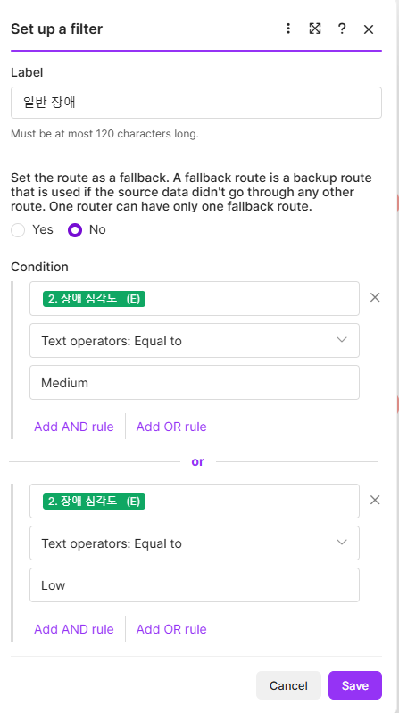

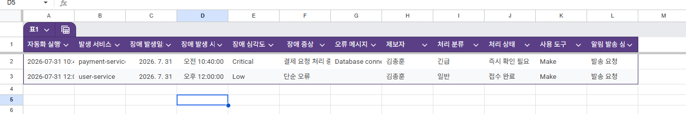

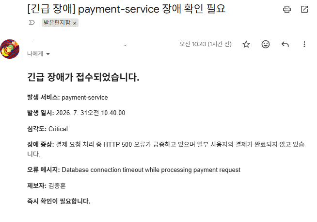

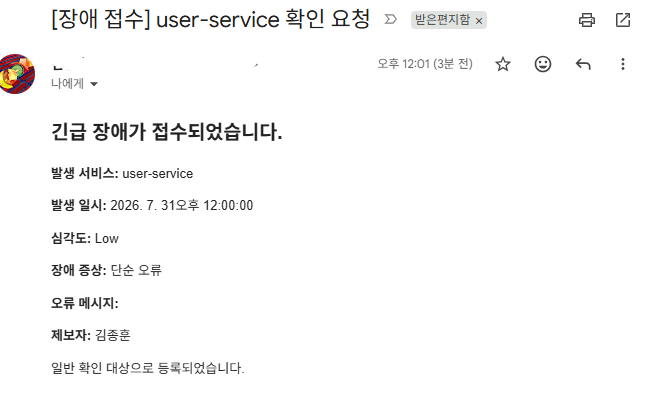

---

## 18. 프로젝트 2 테스트 결과

### 긴급 장애 테스트

| 항목 | 입력값 |
|---|---|
| 발생 서비스 | payment-service |
| 장애 발생일 | 테스트 실행일 |
| 장애 발생 시간 | 오전 10시 40분 |
| 장애 심각도 | Critical |
| 장애 증상 | 결제 요청 처리 중 HTTP 500 오류 급증 |
| 오류 메시지 | Database connection timeout while processing payment request |
| 제보자 | 김종훈 |

확인 결과:

- 긴급 경로 실행
- 결과 시트에 `긴급`, `즉시 확인 필요`로 저장
- 긴급 장애 이메일 발송

### 일반 장애 테스트

| 항목 | 입력값 |
|---|---|
| 발생 서비스 | monitoring-service |
| 장애 발생일 | 테스트 실행일 |
| 장애 발생 시간 | 오전 10시 50분 |
| 장애 심각도 | Low |
| 장애 증상 | 일부 메트릭 수집 지연 |
| 오류 메시지 | Scrape timeout |
| 제보자 | 김종훈 |

확인 결과:

- 일반 경로 실행
- 결과 시트에 `일반`, `접수 완료`로 저장
- 일반 장애 이메일 발송

---

## 19. Trigger, Action, 조건 분기 설명

### Trigger

Trigger는 자동화가 시작되는 이벤트이다.

본 과제에서는 Google Form 제출로 Google Sheets에 새 행이 추가되는 시점을 Trigger로 사용하였다.

### Action

Action은 Trigger 이후 실행되는 처리 동작이다.

본 과제의 주요 Action은 다음과 같다.

- Google Sheets 결과 시트에 행 추가
- Gmail 이메일 발송

### 조건 분기

조건 분기는 입력 데이터의 값에 따라 서로 다른 처리 경로를 실행하는 기능이다.

- Make: Router와 Filter 사용
- Zapier: Paths 사용

프로젝트 1에서는 마감일까지 남은 기간을 기준으로 분기했고, 프로젝트 2에서는 장애 심각도를 기준으로 분기하였다.

---

## 20. 보안 및 제출 시 주의사항

스크린샷과 문서에는 다음 정보가 노출되지 않도록 확인한다.

- Gmail 전체 주소
- Google 계정 이름
- 인증 토큰
- API Key
- Webhook URL
- 개인 식별이 가능한 민감정보

필요한 경우 다음처럼 마스킹한다.

```text
example***@gmail.com
```

또한 제출 전 긴급·일반 경로가 각각 최소 한 번 이상 실행된 결과를 확인하고, 워크플로우 화면과 실행 결과 화면을 함께 첨부한다.

---

## 21. 최종 결과

두 프로젝트를 통해 다음 내용을 확인하였다.

- Trigger가 발생하면 수동 개입 없이 워크플로우가 자동 실행됨
- Action 2개 이상을 연결해 결과 저장과 이메일 알림을 수행함
- Router, Filter, Paths를 이용해 조건별 경로를 분리함
- Make와 Zapier의 날짜 처리 및 분기 방식 차이를 비교함
- 각 프로젝트에서 모든 분기 경로를 테스트함
- 반복 업무를 실제로 동작하는 자동화 워크플로우로 구현함
